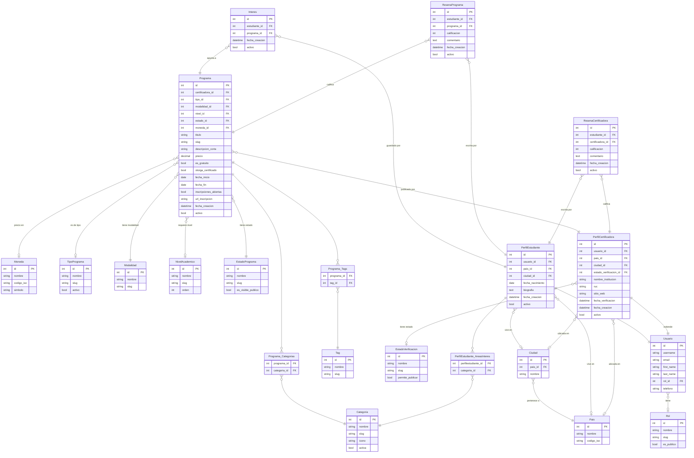

# Diagrama Mermaid — Certikey API

```mermaid
erDiagram

    %% ─── CATALOGOS ───────────────────────────────────────────────

    Pais {
        int id PK
        string nombre
        string codigo_iso
    }

    Ciudad {
        int id PK
        int pais_id FK
        string nombre
    }

    Moneda {
        int id PK
        string nombre
        string codigo_iso
        string simbolo
    }

    Rol {
        int id PK
        string nombre
        string slug
        bool es_publico
    }

    Categoria {
        int id PK
        string nombre
        string slug
        string icono
        bool activa
    }

    Tag {
        int id PK
        string nombre
        string slug
    }

    TipoPrograma {
        int id PK
        string nombre
        string slug
        bool activo
    }

    Modalidad {
        int id PK
        string nombre
        string slug
    }

    NivelAcademico {
        int id PK
        string nombre
        string slug
        int orden
    }

    EstadoPrograma {
        int id PK
        string nombre
        string slug
        bool es_visible_publico
    }

    EstadoVerificacion {
        int id PK
        string nombre
        string slug
        bool permite_publicar
    }

    %% ─── USUARIOS ────────────────────────────────────────────────

    Usuario {
        int id PK
        string username
        string email
        string first_name
        string last_name
        int rol_id FK
        string telefono
    }

    PerfilEstudiante {
        int id PK
        int usuario_id FK
        int pais_id FK
        int ciudad_id FK
        date fecha_nacimiento
        text biografia
        datetime fecha_creacion
        bool activo
    }

    PerfilCertificadora {
        int id PK
        int usuario_id FK
        int pais_id FK
        int ciudad_id FK
        int estado_verificacion_id FK
        string nombre_institucion
        string ruc
        string sitio_web
        datetime fecha_verificacion
        datetime fecha_creacion
        bool activo
    }

    %% ─── PROGRAMAS ───────────────────────────────────────────────

    Programa {
        int id PK
        int certificadora_id FK
        int tipo_id FK
        int modalidad_id FK
        int nivel_id FK
        int estado_id FK
        int moneda_id FK
        string titulo
        string slug
        string descripcion_corta
        decimal precio
        bool es_gratuito
        bool otorga_certificado
        date fecha_inicio
        date fecha_fin
        bool inscripciones_abiertas
        string url_inscripcion
        datetime fecha_creacion
        bool activo
    }

    %% ─── INTERESES ───────────────────────────────────────────────

    Interes {
        int id PK
        int estudiante_id FK
        int programa_id FK
        datetime fecha_creacion
        bool activo
    }

    %% ─── RESEÑAS ─────────────────────────────────────────────────

    ResenaPrograma {
        int id PK
        int estudiante_id FK
        int programa_id FK
        int calificacion
        text comentario
        datetime fecha_creacion
        bool activo
    }

    ResenaCertificadora {
        int id PK
        int estudiante_id FK
        int certificadora_id FK
        int calificacion
        text comentario
        datetime fecha_creacion
        bool activo
    }

    %% ─── TABLAS M2M (implícitas) ─────────────────────────────────

    Programa_Categorias {
        int programa_id FK
        int categoria_id FK
    }

    PerfilEstudiante_AreasInteres {
        int perfilestudiante_id FK
        int categoria_id FK
    }

    Programa_Tags {
        int programa_id FK
        int tag_id FK
    }

    %% ─── RELACIONES ──────────────────────────────────────────────

    %% Catalogos internos
    Ciudad }o--|| Pais : "pertenece a"

    %% Usuarios
    Usuario }o--o| Rol : "tiene"
    PerfilEstudiante ||--|| Usuario : "extiende"
    PerfilEstudiante }o--o| Pais : "vive en"
    PerfilEstudiante }o--o| Ciudad : "vive en"
    PerfilCertificadora ||--|| Usuario : "extiende"
    PerfilCertificadora }o--o| Pais : "ubicada en"
    PerfilCertificadora }o--o| Ciudad : "ubicada en"
    PerfilCertificadora }o--o| EstadoVerificacion : "tiene estado"

    %% Programas
    Programa }o--|| PerfilCertificadora : "publicado por"
    Programa }o--o| TipoPrograma : "es de tipo"
    Programa }o--|| Modalidad : "tiene modalidad"
    Programa }o--o| NivelAcademico : "requiere nivel"
    Programa }o--|| EstadoPrograma : "tiene estado"
    Programa }o--o| Moneda : "precio en"

    %% M2M explícitas
    Programa ||--o{ Programa_Categorias : ""
    Programa_Categorias }o--|| Categoria : ""
    PerfilEstudiante ||--o{ PerfilEstudiante_AreasInteres : ""
    PerfilEstudiante_AreasInteres }o--|| Categoria : ""
    Programa ||--o{ Programa_Tags : ""
    Programa_Tags }o--|| Tag : ""

    %% Intereses
    Interes }o--|| PerfilEstudiante : "guardado por"
    Interes }o--|| Programa : "apunta a"

    %% Reseñas
    ResenaPrograma }o--|| PerfilEstudiante : "escrita por"
    ResenaPrograma }o--|| Programa : "califica"
    ResenaCertificadora }o--|| PerfilEstudiante : "escrita por"
    ResenaCertificadora }o--|| PerfilCertificadora : "califica"
```
